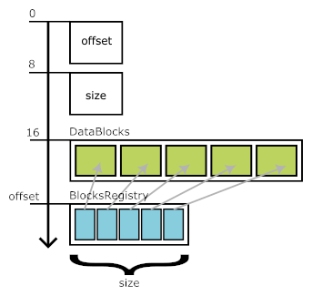
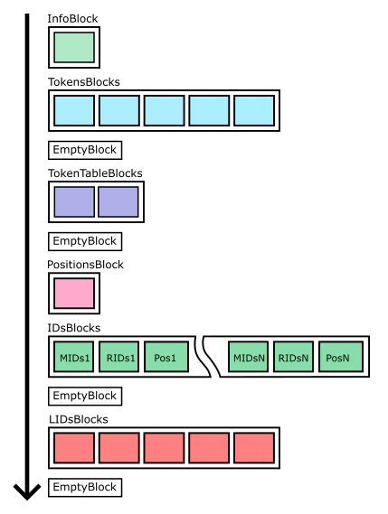

# Format of Index File of Sealed Fraction

## See also

 * [Fractions](./fractions.md)
 * [Format of Documents and Metadata File](./format-docs-meta-file.md)
 * **Format of Index File of Sealed Fraction**

Index file is a part of fraction data. It has \*.index extention and contains index of documents from \*.docs file.

## High level structure

 * **8** first bytes - Offset of **BlocksRegistry** block from the begining of file (**= N + 16**)
 * **8** next bytes - Size of **BlocksRegistry** block (**= K**)
 * **N** next bytes - Section of **DataBlocks** - a series of different data blocks
 * **K** next bytes - Section of **BlocksRegistry** block - and index of blocks (offsets, sizes, etc.) in **DataBlocks** section

This order of sections is determined by the way of writing: each time we write **DataBlock** on disk we "remember" position, size and possibly other metadata.
Then, after all **DataBlocks** have been written, we write that blocks metadata to the **BlocksRegistry** section at the end of the file.



## DataBlocks structure

**DataBlocks** consist of 6 sections:
 * Section with one **InfoBlock** (see `DiskInfoBlock.pack()`) contains stats data of fraction in json format.
 * Section with several **TokensBlocks** (see `DiskTokensBlock.pack()` method). Contains a list of sorted tokens.
 * **EmptyBlock**
 * Section with several **TokenTablesBlocks** (see `DiskTokenTableBlock.pack()` method). Contains an index for **TokensBlocks**.
 * **EmptyBlock**
 * Section with one **PositionsBlock** (see `DiskPositionsBlock.pack()` method). Contains an index of DocBlocks in  \*.docs file, i.e. a list with position of each **DocumentBlock**.
 * Section with several **IDsBlocks** (see `DiskIDsBlock.pack()` method). Physically, each **IDsBlock** represents 3 blocks:
    * **MIDsBlock** - just list of MIDs
    * **RIDsBlock** - just list of RIDs
    * **PosBlock** - position of documents. Each position is a _uint64_ where first 34 bits is index of block (from PositionsBlock) and the rest of 30 bits it is position of document (byte offset) inside **DocumentBlock** in \*.docs file
 
     For each block type (**MIDsBlock**, **RIDsBlock**, **PosBlock**) we have the same ID order. Thus, for each triple, the values in the same positions correspond to the same ID.
 * **EmptyBlock**
 * Section with several **LIDsBlocks** (see `DiskLIDsBlock.pack()` method) - a list of LIDs sorted by fields, tokens, MIDs and RIDs. In **BlocksRegistry** we store the _range of TIDs_ for each **LIDsBlocks** so we can easily find desired block.
 * **EmptyBlock**



## BlocksRegistry block structure

**BlocksRegistry** block is a series of fixed-size structuries called **BlocksRegistryEntry**. 
Each **DataBlock** corresponds to one of the **BlocksRegistryEntry**. 
The order of the **DataBlocks** is the same as the order of the corresponding **BlocksRegistryEntries**.

There are also an _empty_ **BlocksRegistryEntries**. Such **EmptyBlocks** do not have corresponding **DataBlock** and are used to separate logical groups of **DataBlocks** from each other.

### Format of BlocksRegistryEntry

See `disk/blocks_registry_entry.go`

```go
// Format: C : LLLL : UUUU : EEEE-EEEE-EEEE-EEEE : PPPP-PPPP
// C -  1 – Codec
// L -  4 – Length
// U -  4 - Length after uncompress
// E - 16 - Extensions/flags
// P -  8 - Position
// ------------------
// Total: 33 bytes
```

**Extensions/flags** part of **BlocksRegistryEntry** is intended to help find a desired block in the **BlocksRegistry** index. So we store in this fields:
 * the _range of TIDs_ for each **LIDsBlocks**. This allows us to choose the appropriate LID block for a particular token.
 * the _minimal MID and RID_ for each **MIDsBlock**. This allows us to choose the appropriate Pos block for a particular MID and RID.

Empty BlocksRegistryEntry is just 33 zero bytes.