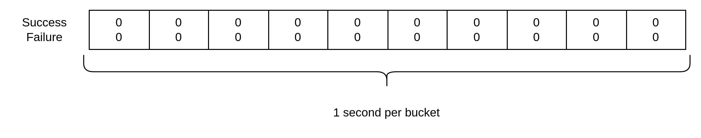
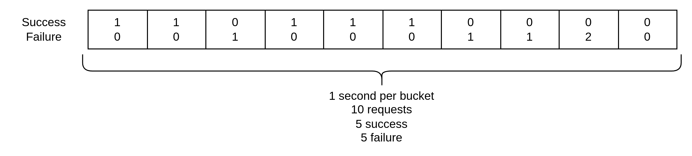
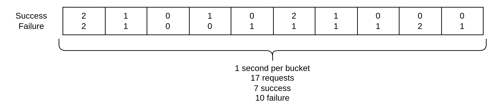

# Circuit breaker configuration

Circuit breaker предотвращает попытки приложения выполнить операцию, которая скорее всего завершится неудачно. 
Он имеет два состояния: закрытый (запросы будут выполняться) и открытый (отвергаем все запросы, пока
circuit не закроется). Используется seq-proxy при работе с шардами, создавая на каждый шард отдельный экземпляр. 

В основе используется алгоритм скользящего окна (rolling window) для временного ряда.
Общий размер окна (rolling window size) - это время, в течение которого хранятся метрики
для использования алгоритмами Closer\Opener. Это окно задается параметрами `NumBuckets * BucketWidth`.

Где `BucketWidth` - размер одной ячейки (bucket) в скользящем окне, а `NumBuckets` - количество ячеек.

Например, для конфига:

```go
Config{
NumBuckets:               10,
BucketWidth:              time.Second,
RequestVolumeThreshold:   15,
ErrorThresholdPercentage: 50,
}
```

Будет создана структура следующего вида:



Представим, что к нам каждую секунду в течение 10 приходил запрос, 5 из которых не были завершены успешно:



Из скользящего окна мы можем взять общее число запросов, обозначим ее переменной `totalRequests`.
Circuit breaker не будет открыт, т.к. значение RequestVolumeThreshold не было превышено:

```go
RequestVolumeThreshold := 15 // from the config
totalRequests := 10
checkPercentage := totalRequests >= RequestVolumeThreshold // false
if !checkPercentage { return }
```

Таким образом, проверка процентного соотношения ошибок не произойдет, хотя количество ошибок 50%.
Эта логика нужна для того, чтобы не открывать circuit breaker в случаях, когда у нас не было достаточного
количества запросов за временное окно.

Для того же конфига, но следующего распределения:



```go
RequestVolumeThreshold := 15 // from the config
totalRequests := 17
checkPercentage := totalRequests >= RequestVolumeThreshold // true
if !checkPercentage { return }

fails := 10
shouldOpen := fails / totalRequests * 100 > ErrorThresholdPercentage // true
if shouldOpen { open() }
```

Теперь circuit breaker откроется и перестанет выполнять запросы, сразу же возвращая ошибку.
Так будет происходить до тех пор, пока во время `SleepWindow` не будет произведен один успешный запрос.
