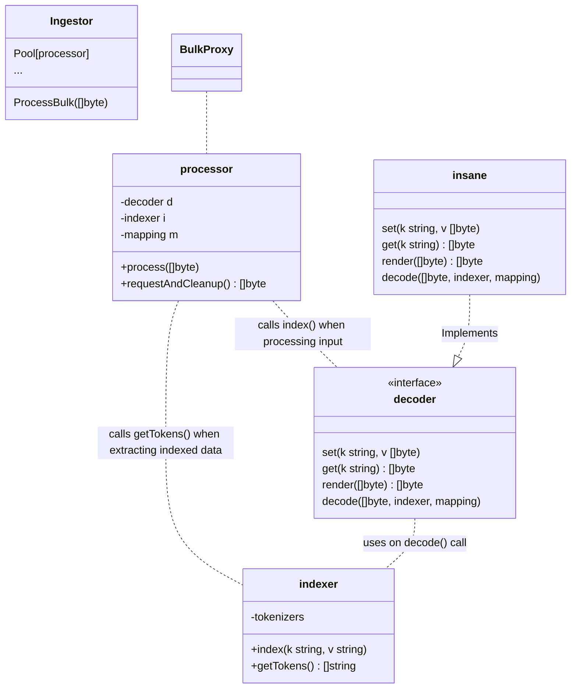

# Bulk proxy
The following diagram describes the high level architecuture of the structures used to handle bulk requests in seq-proxy.

```mermaid
classDiagram
  direction TB
    class Ingestor {
        Pool[processor]
        ...
        ProcessBulk([]byte)
    }
%%    note for Ingestor "handles bulk logic, manages a pool of processors"

    class processor {
        -decoder d
        -indexer i
        -mapping m

        +process([]byte) 
        +requestAndCleanup() []byte
    }


%%    note for processor "accumulates meta and docs from a single bulk, returns  request ready to be sent to store"


    class decoder {
        <<interface>>
        set(k string, v []byte) 
        get(k string) []byte
        render([]byte) []byte
        decode([]byte, indexer, mapping)
    }

    processor .. decoder: calls index() when processing input
    processor .. indexer: calls getTokens() when extracting indexed data
    decoder .. indexer: uses on decode() call
    BulkProxy .. processor

    class indexer {
        +index(k string, v string) 
        +getTokens() []string

        -tokenizers
    }

    class insane {
        set(k string, v []byte) 
        get(k string) []byte
        render([]byte) []byte
        decode([]byte, indexer, mapping)
    }

%%    note for decoder "defines the interface that must be implemented, for libraries/formats used to decode incoming bulk requests."

%%    note for indexer "indexes input values, knows the mapping, uses specific tokenizers depending on the key value, keeps a list of extracted tokens"

    insane..|>decoder : Implements
```